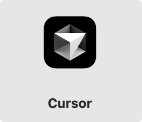
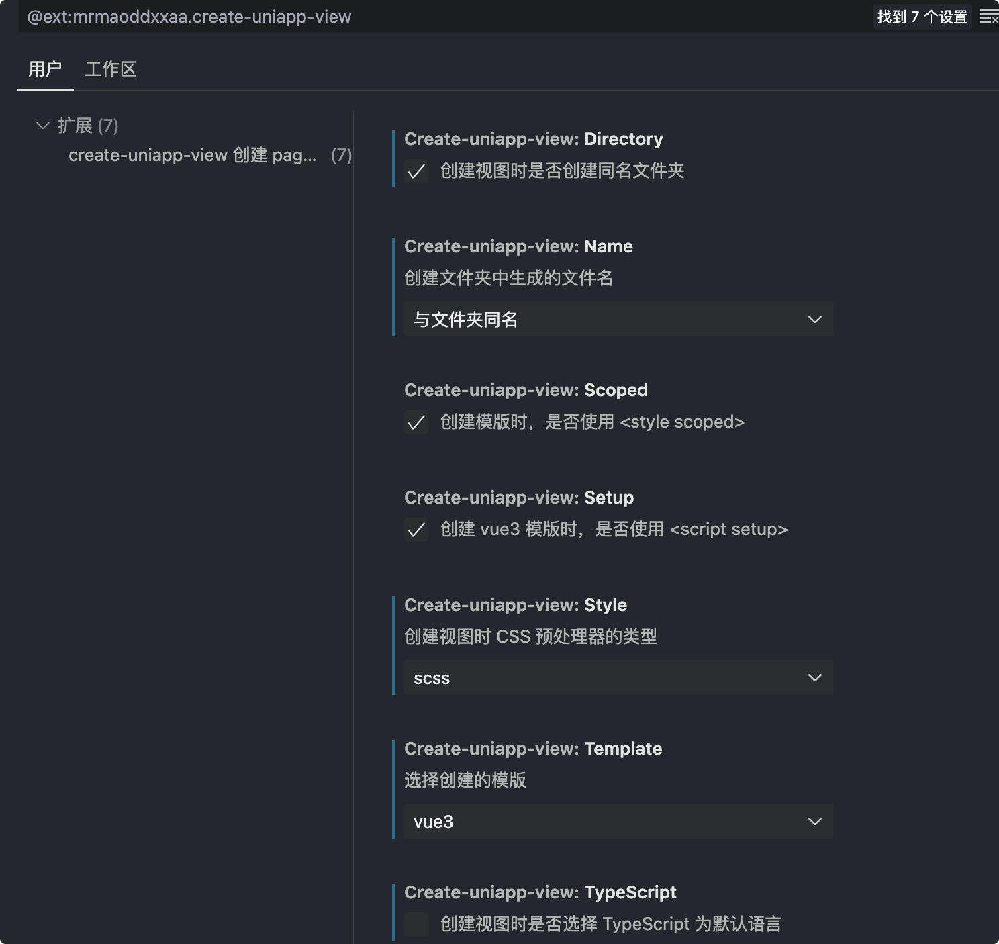
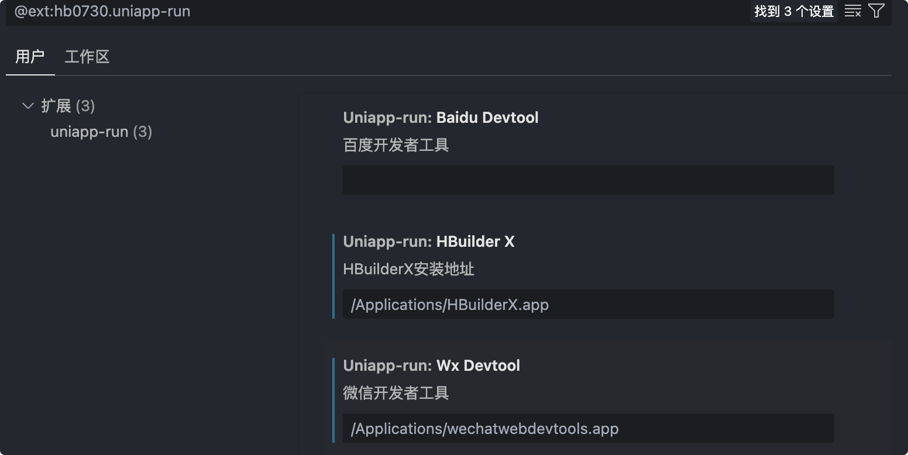
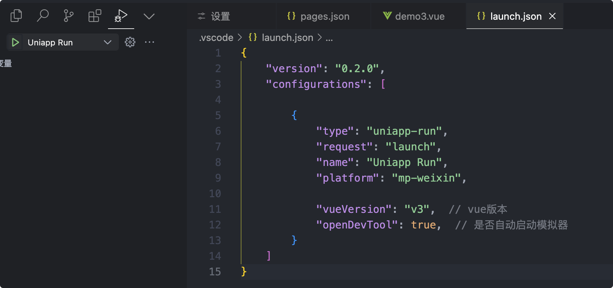

## 使用 Cursor 运行 uniapp 项目

### 1. 安装 Cursor

### 2. 安装插件

a.  uniapp run 可以运行项目基于微信开发者工具，需要配置微信开发者工具路径
b.  uniapp-create-view 等插件是为了更好编写代码

### 3. 插件设置

a.	

b.	

c.	运行项目配置文件如下，点击 uniapp run 即可运行至微信开发者工具

### 总结
a.	Cursor 可以运行 uniapp 项目，和 vscode 一样，可以编写代码，运行项目，调试项目
b.	Cursor 的AI可以更好编写代码，运行项目，调试项目

